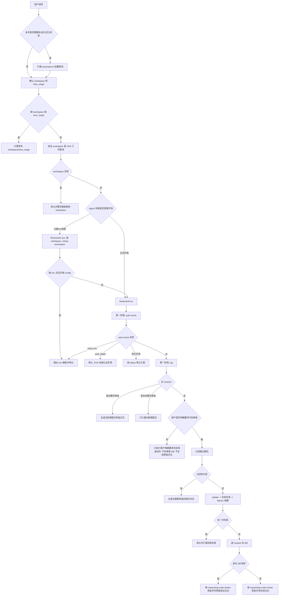

# ZHERP-Automation

## 目标

执行 ZHERP/YigoERP 项目的 SVN 自动化。先完成认证和日志拉取，再按用户请求决定是否进入更新、构建、实体生成、diff 拉取和代码审查。禁止把认证、取数、更新、构建、实体生成和审查混成一个大步骤反复重试。

## 执行边界

- 全程使用中文沟通和汇报。
- Windows 环境下执行命令，中文文件固定按 UTF-8 处理。
- 这是 SVN 自动化 skill，不按 Git 工作流处理。
- 所有输出、运行日志和审查日志中禁止出现 `SVN_PASSWORD` 明文值。
- 如果用户没有明确要求代码审查或审查提交，不进入代码审查流程，不拉取审查 diff，不生成审查日志。
- SVN 认证配置只以本次用户提供的信息和 `<workspace>\.zherp-automation` 下的文件为准；不要从 memory、历史会话、自动化记忆或 rollout 记录中复用历史成功方式。
- `<workspace>\.zherp-automation` 是本机私有自动化配置目录，可能包含 SVN 认证缓存或本机路径；禁止把它加入 SVN 或提交。

## 固定执行顺序

任何任务都按这个顺序走，缺哪一步就停在那一步，不要跳到后面补救：

1. 判断本次任务是否需要自动化记忆目录；普通会话不需要时跳过该探测。
2. 确认 `workspace` 和 `time_range`；用户说“当日、当天、今日提交”但未给起止时间时，按默认业务日窗口处理。完全没说时间范围时，再询问用户。
3. 验证 `workspace` 是本地 SVN 工作副本。
4. 判断当前是否为沙箱、CI 或受限自动化用户，并准备 `@svnArgs`。
5. 执行第一阶段：最小认证验证，再拉日志。
6. 第一阶段失败就停止；第一阶段成功后，只执行用户明确要求的后续动作。
7. 只有用户明确要求代码审查时，才执行完整审查流程并生成审查日志。

## 流程决策树

按这棵树执行，不要把后面的认证、构建或审查步骤提前：



## 脚本优先

认证、日志、diff、更新、Maven 配置、实体生成和审查日志路径这些机械步骤，优先调用 [zherp_svn.ps1](scripts/zherp_svn.ps1)。脚本只依赖 Windows PowerShell，不依赖 Python 或第三方包。

不要把 Python、pip、Python 依赖安装或 `quick_validate.py` 当成使用本 skill 的前置条件。`quick_validate.py` 只属于 skill 作者维护时的本机校验，不属于 ZHERP-Automation 的运行流程。需要给使用者做轻量自检时，只运行 `zherp_svn.ps1 env-template`、`prepare`、`maven-config` 这类不触发远端取数或构建的 PowerShell 命令。

脚本返回 JSON，按 `status` 决定下一步：

- `ok`：继续下一步。
- `restricted_unresolved`：停止；这是 Agent 没有完成沙箱/正式环境判断导致的配置错误。不要继续认证，不要因为 `<workspace>\.zherp-automation` 不存在就按非受限执行；必须由 Agent 根据当前会话工具权限重新传 `-Restricted yes` 或 `-Restricted no`。
- `need_env`：停止；再调用 `env-template` 打印干净模板并直接给用户。不要给“直接提供 config 目录”的并列分支。
- `workspace_invalid`：停止并要求用户重新提供 `workspace`。
- `config_error` / `path_out_of_scope`：停止并指出缺失配置或越界路径；不要为了绕过边界去读写 workspace 外的 env、config、diff 或报告目录。
- `svn_not_found`：停止并要求用户提供可执行的 `svn.exe` 路径，优先写入 `<workspace>\.zherp-automation\svn-automation.env` 的 `SVN_CMD`。
- `auth_failed`：停止，汇报“本次阻塞于 SVN 远端认证失败”。
- `log_failed` / `update_failed`：停止并汇报对应阶段失败；不要继续后续 diff、构建或审查。
- `maven_not_found` / `maven_settings_missing` / `maven_pom_missing` / `maven_failed`：停止并汇报对应构建阻塞。
- `diff_failed`：可以生成审查日志，但必须标注“部分 revision 缺少 diff，结论受限”。

脚本在非 `ok` 状态下会用非零退出码结束。不要只看退出码；必须读取 JSON 里的 `status`。

特别注意：`<workspace>\.zherp-automation` 是否存在，只能说明 workspace 下是否已经有受限环境本地配置，不能用来判断当前会话是否正式环境。缺少 `.zherp-automation` 时，如果当前会话是沙箱、CI 或受限自动化用户，正确分支是 `-Restricted yes` 后返回 `need_env`，不是 `-Restricted no`。

脚本只允许把 env、SVN config、日志输出、diff 输出和审查日志路径放在 `workspace` 约束范围内。`EnvFile` 和 `ConfigDir` 必须位于 `<workspace>\.zherp-automation`；`Output`、`OutputDir` 和 `ReportRoot` 必须位于 `workspace` 内。不要要求用户提供 workspace 外的认证或输出路径。

常用命令形态：

```powershell
$restricted = "<yes-or-no-after-agent-judgement>"
powershell -NoProfile -ExecutionPolicy Bypass -File <skill>\scripts\zherp_svn.ps1 prepare -Workspace <workspace> -Start "<start>" -End "<end>" -Restricted $restricted
powershell -NoProfile -ExecutionPolicy Bypass -File <skill>\scripts\zherp_svn.ps1 auth-check -Workspace <workspace> -Restricted $restricted
powershell -NoProfile -ExecutionPolicy Bypass -File <skill>\scripts\zherp_svn.ps1 log -Workspace <workspace> -Start "<start>" -End "<end>" -Restricted $restricted
powershell -NoProfile -ExecutionPolicy Bypass -File <skill>\scripts\zherp_svn.ps1 post-log-prep -Workspace <workspace> -Restricted $restricted
powershell -NoProfile -ExecutionPolicy Bypass -File <skill>\scripts\zherp_svn.ps1 diff -Workspace <workspace> -Revisions r123 r124 -Restricted $restricted
```

需要模板时使用：

```powershell
powershell -NoProfile -ExecutionPolicy Bypass -File <skill>\scripts\zherp_svn.ps1 env-template -Workspace <workspace>
```

模型仍负责代码审查判断、风险解释和最终审查日志内容；不要把审查判断外包给脚本。

## 自动化记忆目录按需探测

本节只在本次任务需要写入或更新自动化记忆、状态文件、运行记录、审查日志索引，或当前运行明确属于自动化任务时执行。普通会话只使用本 skill 做 SVN 日志、更新、构建、实体生成或代码审查时，可以跳过本节，不要因为 `automations` 不存在或不可写而阻塞主流程。

`$env:USERPROFILE\.codex\automations` 是 Codex 自动化记忆/状态目录，不是 SVN 认证配置目录，也不是本步骤的认证资料来源。不要把它当成 `svn_config_dir`，不要把 SVN auth 或 `SVN_PASSWORD` 写入该目录，也不要在本前置探测步骤读取里面的历史文件来推断 SVN 认证方式。

需要执行本节时，只允许做最轻量的可访问性探测：

1. 先用当前进程的 `$env:USERPROFILE` 解析实际目录：`$automations = Join-Path $env:USERPROFILE ".codex\automations"`。不要把包含 `<user>` 的示例路径当成真实路径。
2. 只允许检查目录是否存在、能否访问；目录不存在时可以创建。
3. 需要确认可写时，只允许写入一个不含敏感信息的临时检查标记，然后立即删除该标记。
4. 本前置探测步骤禁止列出、读取、搜索或解析 `automations` 目录下的任何已有文件。
5. 本前置探测步骤禁止使用 `automations` 目录里的历史日志、记忆、状态文件或历史成功命令作为 SVN 认证依据。
6. 本前置探测步骤禁止从 `automations` 目录获取 `svn_config_dir`、`SVN_USERNAME`、`SVN_PASSWORD` 或任何认证参数。
7. 如果无法访问或写入，且本次任务确实需要写自动化记忆/状态，再检查 `$env:USERPROFILE\.codex\config.toml` 是否存在 `writable_roots`，并确认其中包含上一步解析出的 `automations` 实际目录。
8. 如果 `config.toml` 不存在、无法访问，或没有包含该目录，只阻塞会写自动化记忆/状态的步骤，并要求用户配置 `writable_roots`；不要阻塞不依赖自动化记忆的 SVN 日志、更新、构建、实体生成或代码审查主流程。
9. 即使自动化记忆目录不可写，也不要绕开到主用户 SVN auth 缓存；SVN 受限环境配置仍按 `<workspace>\.zherp-automation` 流程处理。

完成本前置探测后，如果后续自动化任务本身需要读取或更新自动化记忆，可以按任务需要处理；但 SVN 认证配置来源仍只能按 `workspace` 和 `<workspace>\.zherp-automation` 流程确认，不能用 `automations` 历史文件替代。

## 代码审查请求的硬门槛

如果用户明确要求代码审查或审查提交，第一步只做配置核对，不先扫盘找仓库，不先拉日志，不先拉 diff。

配置核对必须按顺序执行，禁止跳到后面的认证配置：

1. 先确认 `workspace`。只有用户明确提供的 ZHERP SVN 工作副本路径才能作为 `workspace`；不要把当前 Codex 会话 `cwd`、临时工作区或示例路径当成 ZHERP 工作副本，也不要自行扫描磁盘猜测工作副本。
2. 验证 `workspace`：目录必须存在，并且能识别为本地 SVN 工作副本。验证失败时停止并要求用户重新提供 `workspace`；不要把工作副本验证失败误判为 SVN 远端认证失败。
3. 再确认 `time_range`。用户说“当日、当天、今日提交”但未给起止时间时，按默认业务日窗口处理；完全没说时间范围时，询问使用自定义范围还是默认业务日窗口。
4. 只有 `workspace` 和 `time_range` 都明确后，才判断是否为沙箱、CI 或受限自动化用户。
5. 如果是受限环境，先在用户提供的 `<workspace>\.zherp-automation\` 下查找本地自动化配置；找不到再要求用户按模板创建变量文件。不要让用户在“创建 env 文件”和“直接提供 config 目录”之间二选一。
6. 完整代码审查不可裁剪：第一阶段成功且 revision 列表非空后，必须依次执行 `svn update`、实体生成、Maven 构建、逐 revision 拉 diff、生成审查日志。
7. 缺少 Maven 或实体生成配置时，按配置发现规则处理：`maven_cmd` 先自动探测全局 Maven，失败后再要求用户提供；`maven_settings` 先检查 `<workspace>\bokeerp\maven_settings.xml`；`entity_generator_module` 默认 `../erp-entity-generator`。
8. 只有用户明确要求“只看 diff”“跳过构建”或“跳过实体生成”时，才允许裁剪完整审查流程，并必须在审查日志中说明结论受限。

如果同时缺少 `workspace` 和 `time_range`，只询问这两项；不要在同一轮要求用户提供变量文件或 `svn_config_dir`。

## 先收集配置

如果用户已经在请求中提供环境信息，直接使用。缺少必要信息时，按上面的顺序要求用户补齐，不要猜。

基础必要配置：

- `workspace`: ZHERP 工作目录，例如用户本机的 ZHERP 工作副本路径。不要自行扫描磁盘猜测该路径。
- `time_range`: 日志或审查时间范围；支持用户指定起止时间。用户说“当日、当天、今日提交”但未给起止时间时，使用默认业务日窗口：本地当前日期前一天 `19:00:00` 到当前日期 `18:59:59`。完全没说时间范围时，再询问用户。

按动作补充配置：

- Agent 判断当前是沙箱、CI 或受限自动化用户时，需要受限环境 SVN 配置；优先从 `<workspace>\.zherp-automation\svn-automation.env` 和 `<workspace>\.zherp-automation\svn-config-codexsandbox` 发现。正式环境无需额外处理。
- 用户要求 Maven 构建或完整审查时，需要 `maven_cmd` 和 `maven_settings`。`maven_cmd` 先自动尝试全局 `mvn.cmd` 或 `mvn`；找不到时要求用户提供。`maven_settings` 先检查 `<workspace>\bokeerp\maven_settings.xml`；不存在时要求用户提供。
- 用户要求实体生成或完整审查时，需要 `entity_generator_module`；缺失时默认使用 `../erp-entity-generator`，除非用户明确覆盖。
- 用户要求代码审查时，需要 `report_root`，通常为 `automation-output\svn审查`。

可选配置：

- `svn_username`: 需要恢复认证缓存或显式认证时使用
- `svn_password_env_file`: 只允许读取当前流程指定的安全 env 文件，且不得输出内容
- `skip_log_patterns`: 默认跳过包含 `【 ZHERP】` 或 `【Jenkins 发布版本】` 的日志

详细配置清单见 [environment.md](references/environment.md)。

## 沙箱与 SVN 认证

在 `workspace` 和 `time_range` 明确后，再由 Agent 判断当前环境是否是沙箱、CI 或受限自动化用户。判断依据包括：当前工具权限提示、filesystem sandbox 状态、writable roots、是否能写入目标 SVN config 目录、用户是否提供了自动化专用 config 目录等。

- 正式环境无需额外处理 SVN config-dir。
- 如果判断为沙箱、CI 或受限自动化用户，必须使用 `--config-dir <svn_config_dir>`，不能读取或迁移主用户 SVN auth 缓存。
- 沙箱、CI 或受限自动化用户执行 `svn` 命令时，必须显式带上 `--non-interactive --no-auth-cache --config-dir <svn_config_dir>`。
- 调用脚本时，Agent 应把判断结果显式传给 `-Restricted yes` 或 `-Restricted no`。`-Restricted auto` 只能作为已有 workspace 本地配置的兜底探测，不能代替 Agent 对当前会话沙箱状态的判断。
- 如果脚本返回 `restricted_unresolved`，说明 Agent 误用了 `-Restricted auto` 或没有完成环境判断；必须重新按本节判断并显式传 `yes/no`。禁止把“没有 `.zherp-automation`”解释成“正式环境”。
- 认证恢复只能从用户明确提供的 env 文件读取 `SVN_PASSWORD` 到当前进程变量，使用 `--password-from-stdin` 传给 `svn`。
- 如果受限环境 `auth-check` 成功，且 `svn-automation.env` 中存在 `SVN_USERNAME` 和 `SVN_PASSWORD`，脚本会自动移除这两项，只保留 `SVN_CMD`、`MAVEN_CMD`、`MAVEN_SETTINGS`、`ENTITY_GENERATOR_MODULE`、`REPORT_ROOT` 等非密钥配置。后续如果认证缓存失效或更换沙箱用户，`auth-check` 会在最小认证失败后再次要求补回用户名和密码。
- 禁止使用 `--password 明文`。
- 禁止打印 env 文件内容。
- 禁止读取、解密、迁移或输出任何已有 SVN auth 缓存中的密码。

SVN 参数必须在执行命令前展开，禁止原样执行文档占位符：

- 正式环境：`$svnArgs = @()`，不额外处理 `config-dir`。
- 沙箱、CI 或受限自动化用户：`$svnArgs = @("--non-interactive", "--no-auth-cache", "--config-dir", $svnConfigDir)`。
- 认证引导需要生成受限环境独立 config 时，使用 `$svnBootstrapArgs = @("--non-interactive", "--config-dir", $svnConfigDir)` 并通过 `--password-from-stdin` 传入密码。该命令只用于首次认证引导，不用于正式日志、更新或 diff 取数。
- 文档里的 `@svnArgs` 表示 PowerShell 参数数组；执行前必须已经按上面规则赋值。

认证引导命令形态：

```powershell
$env:SVN_PASSWORD | svn log -l 1 --username $env:SVN_USERNAME --password-from-stdin @svnBootstrapArgs .
```

该命令只展示形态。实际执行前必须确认 `$env:SVN_PASSWORD` 来自用户指定 env 文件，且不得打印变量值。

## 受限环境认证引导

仅当 Agent 判断当前是沙箱、CI 或受限自动化用户时执行本节。正式环境跳过本节。优先用脚本执行本节；只有脚本不可用时才按下面文字流程手工执行。

1. 先在已提供的 `workspace` 内查找本地自动化配置，不要扫描 workspace 之外的磁盘：
   - 独立 SVN config 目录：`<workspace>\.zherp-automation\svn-config-codexsandbox`
   - 变量文件：`<workspace>\.zherp-automation\svn-automation.env`
2. 如果独立 SVN config 目录已存在，将其作为 `$svnConfigDir`，同时设置 `@svnArgs` 和 `$svnBootstrapArgs`，然后进入第一阶段；同时记录变量文件默认路径，但不要因为已有 config 目录就要求用户创建变量文件。
3. 如果独立 SVN config 目录不存在，再查找变量文件。
4. 如果变量文件不存在，要求用户创建 `<workspace>\.zherp-automation\svn-automation.env`，并在回复中直接给出下面的 env 模板；不要只说“按模板创建”，不要要求用户直接在对话里粘贴密码，也不要把“直接提供 svn-config-codexsandbox 目录”作为并列选项。
5. 如果找到变量文件，读取其中变量到当前进程；不得输出文件内容，不得把 `SVN_PASSWORD` 写入日志或审查日志。
6. 如果变量文件缺少 `SVN_USERNAME` 或 `SVN_PASSWORD`，停止并要求用户检查变量文件；不要继续拉日志、更新、构建或审查。
7. 如果变量文件提供了 `SVN_CONFIG_DIR`，使用该目录；否则默认使用 `<workspace>\.zherp-automation\svn-config-codexsandbox`。
8. 如果独立 SVN config 目录不存在，由 Codex 创建该目录。
9. 设置 `@svnArgs` 和 `$svnBootstrapArgs`。不要在本节拉日志或 diff；是否需要认证引导由第一阶段的最小认证失败结果决定。
10. 认证引导成功后，脚本会从变量文件中移除 `SVN_USERNAME` 和 `SVN_PASSWORD`；不要重新写回密码，除非后续 `auth-check` 因认证缓存失效再次返回 `need_env`。

需要用户创建 env 文件时，必须直接给出此模板，让用户只替换尖括号内容：

```dotenv
# ZHERP-Automation local secrets. Do not commit this file or this directory.
SVN_USERNAME=<your svn username>
SVN_PASSWORD=<your svn password>
SVN_CONFIG_DIR=<workspace>\.zherp-automation\svn-config-codexsandbox

# Optional. Fill these only when this machine cannot auto-detect them.
SVN_CMD=<path to svn.exe>
MAVEN_CMD=<path to mvn.cmd>
MAVEN_SETTINGS=<workspace>\bokeerp\maven_settings.xml
ENTITY_GENERATOR_MODULE=../erp-entity-generator
REPORT_ROOT=<workspace>\automation-output\svn审查
```

## 第一阶段：认证与日志拉取

严格按顺序执行：

1. 调用脚本 `auth-check`。它负责 workspace 本地检查、最小认证验证、受限环境 env 恢复和一次认证引导。
2. 如果脚本返回 `need_env`，把 `env_template` 直接给用户并停止；不要进入第二阶段。
3. 如果脚本返回 `auth_failed`，立即停止。输出：`本次阻塞于 SVN 远端认证失败`。不要进入第二阶段。
4. 如果脚本返回 `workspace_invalid`，停止并要求用户重新提供 `workspace`。
5. `auth-check` 成功后，调用脚本 `log` 拉取 `time_range` 内日志。日志至少包含 revision、提交人、提交时间、提交说明。
6. 如果当天或指定时间范围无提交：用户要求代码审查时，生成简短 Markdown 审查日志说明“无新增提交”；否则只汇报“无新增提交”，不生成审查日志。

不要在第一阶段拉 diff。不要在第一阶段做代码推断。

## 第二阶段：按请求执行后续动作

只有第一阶段成功拿到 revision 列表且列表不为空，且用户请求需要后续动作，才进入第二阶段。用户要求代码审查时，本阶段必须按完整代码审查流程执行，除非用户明确要求裁剪。

如果用户只要求认证验证或日志拉取，第一阶段完成后立即汇报结果并停止。

如果用户没有明确要求代码审查或审查提交，本阶段只执行用户明确要求的动作，例如 `svn update`、Maven 构建或实体生成；不要拉取审查 diff，不要做代码审查分析，不要生成审查日志。

按用户请求选择对应流程：

- 只要求 `svn update`：执行 `svn update`；沙箱、CI 或受限自动化用户必须带 SVN config 参数；完成后汇报结果并停止。
- 只要求 Maven 构建：调用脚本 `maven-build`；完成后汇报结果并停止。
- 只要求实体生成：调用脚本 `entity-generate`；完成后汇报结果并停止。
- 用户同时要求 `svn update`、Maven 构建、实体生成，或要求完整代码审查：调用脚本 `post-log-prep`，由脚本内部严格串行执行 `update -> entity-generate -> maven-build`。禁止用并行工具同时跑这三个步骤。
- 要求代码审查：按下面顺序执行完整流程，并生成审查日志。

完整代码审查流程：

1. 过滤日志，跳过提交说明包含默认跳过模式的 revision。
2. 如果过滤后没有需要审查的 revision，生成简短审查日志说明“无需要审查的提交”，然后停止；不要继续 `svn update`、Maven 构建、实体生成或拉 diff。
3. 调用脚本 `post-log-prep`。该命令内部必须按顺序执行 `svn update -> entity-generate -> maven-build`，任一步失败都会返回对应状态并停止。
4. 禁止把 `update`、`entity-generate`、`maven-build` 放进并行工具或后台任务。`entity-generate` 必须发生在 `svn update` 成功之后，`maven-build` 必须发生在实体生成成功之后。
5. 如果更新、Maven 构建或实体生成失败，立即停止并汇报失败阶段、命令意图和关键错误。不要继续拉 diff 和审查。
6. 调用脚本 `diff` 对每个需要审查的 revision 单独拉取 diff。只基于成功取得的日志和 diff 做分析。
7. 如果部分 revision 无法拉取 diff，审查日志中必须写明：`部分 revision 缺少 diff，结论受限`。
8. 生成标准级 Markdown 审查日志并保存到按日期归档的目录。

Maven 规则：

- 使用 Maven 构建时必须显式指定 `maven_settings`。
- `maven-build` 默认执行 `compile -DskipTests`，用于编译检查，不跑测试，不执行 `package`。只有用户明确要求打包或跑测试时，才通过 `MavenArgs` 覆盖默认参数。
- `entity-generate` 默认执行实体生成模块的 `package`，因为实体生成流程依赖该模块的打包目标。
- 完整流程里必须先实体生成再 Maven 构建；新增或更新实体类被 Java 引用时，先构建会因为实体不存在而失败。
- 如果在 ZHERP 主工程中使用 `-pl`，只能写 `bokeerp/pom.xml` 中 `<module>` 的相对路径。
- `erp-entity-generator` 模块必须写成 `../erp-entity-generator`，不要写成 `-pl erp-entity-generator`。

## 审查口径

按 [requesting-code-review/SKILL.md](references/requesting-code-review/SKILL.md) 执行。

## 审查日志要求

只有用户明确要求代码审查时，才执行本节。

审查日志必须包含：

- 提交人
- 提交时间
- revision
- 变更概览
- 关键风险
- 按严重级别 P 分类的问题
- 理由
- 影响
- 修改建议
- 总体审查结论

审查日志按样例使用 `P0/P1/P2/P3`。如复核输出使用 `Critical/Important/Minor`，生成最终审查日志时按 `Critical -> P0/P1`、`Important -> P1/P2`、`Minor -> P3` 映射；具体级别以实际影响判断。

问题清单只输出实际发现的问题级别。不要为没有问题的 P 级别单独写“未发现”；如果没有任何 P0/P1/P2/P3 问题，问题清单只写一句“未发现需要列入问题清单的问题。”

审查日志模板见 [report-template.md](references/report-template.md)。

落盘时保存到 `report_root\<YYYY-MM-DD>\`。如果同名历史审查日志已存在，生成带时间戳的新文件；只有确认是同一次运行创建的临时文件时，才允许覆盖。
